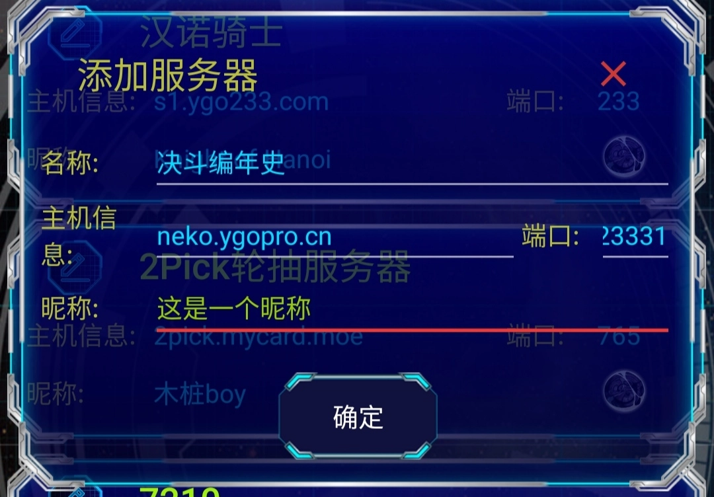

# 编年史手机端使用方法解答
## 事前准备​
下载并安装ygomobile（可以在群文件或者taptap下载）。
## 添加服务器
1. 点击右下角功能菜单按钮。
2. 点击添加服务器按钮。
3. 如图添加一个服务器（决斗编年史的手机端只能在这个服务器使用）。

## 开始决斗
1. 编年史模式需要建立DC#（单打）， T,DC#（双打）形式的房间，推荐使用DC,TM0#（单打）， T,DC,TM0#（双打）形式的不限时房间。也可以进行匹配战，但卡组不会随机。
2. 进入游戏后不需要选择卡组，服务器会自动将你的卡组替换为随机卡组。

## 其他
1. 想要打牌的时候可以先在群里看一下有没有缺人的房间，如果没有推荐自己建房然后来群里叫人。
2. 编年史手机端决斗时尽量不要聊天，因为不明原因，聊天时比较容易掉线。
3. PC端ygopro也可以加入手机端房间，在ygopro中如图填写服务器信息后在主机密码处填写房间号即可。

>编年史手机端建立的房间不能对问题卡组进行举报，所以推荐使用PC上的决斗编年史客户端。

